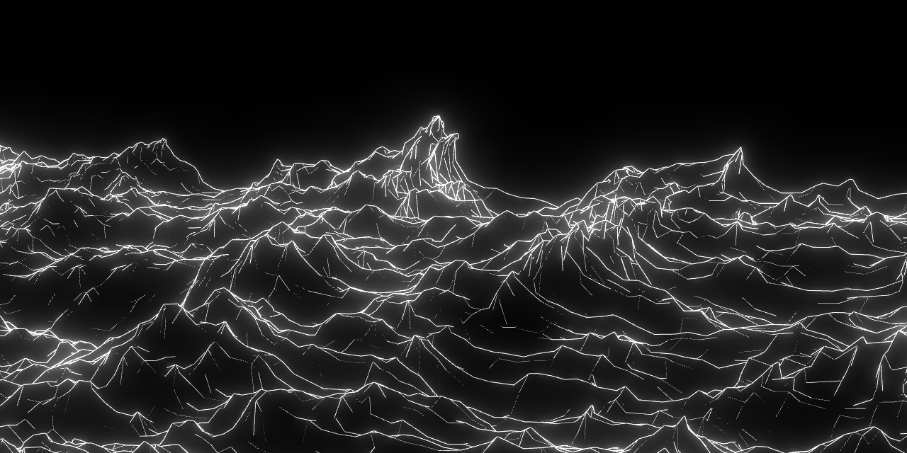
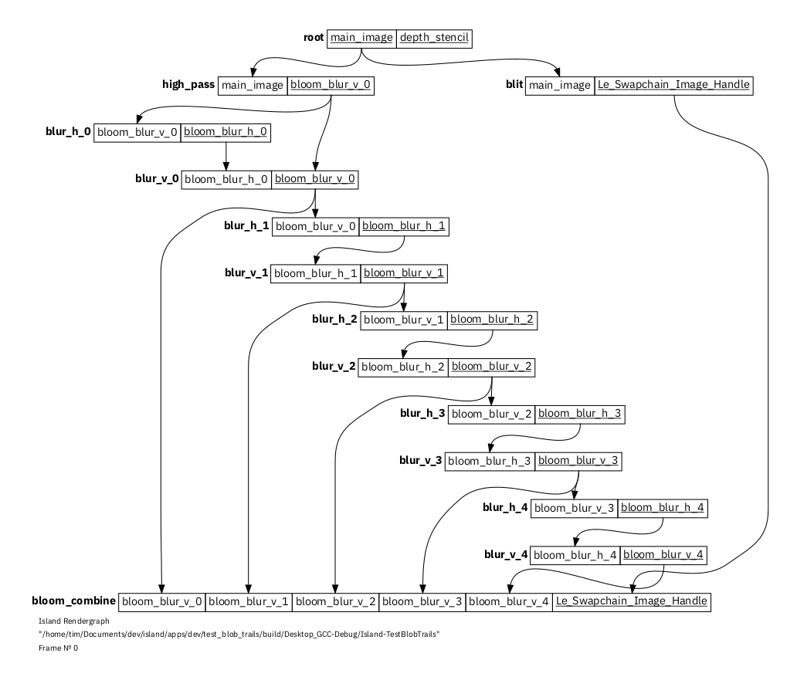
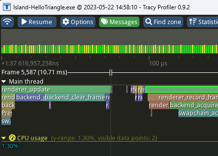

# Project Island 🌋🐎 

Project Island is an experimental **Vulkan** Renderer for Linux and
Windows, written in C/C++. 

Island is written for **rapid protoyping and tweaking**. That's why it
allows **hot-reloading** wherever possible: for **C/C++** application
code, **GLSL** or **HLSL** shader code, even the renderer's own core
modules. 

Island is **fast to compile**. A full rebuild should take < 5s on
a moderate multicore machine, and incremental builds often take < 1s. 

To achieve this aim, Island is structured into strictly separated modules,
which can be dropped in or out during Debug, while for Release, you
can build a single, statically linked and optimised binary.


[](https://github.com/tgfrerer/island/actions/workflows/c-cpp.yml)


## Main Features:

* **Hot-reloading**: An Island project is made from isolated c/cpp
  modules, each of which can be tweaked, re-compiled at runtime, and
  automatically hot-reloaded.

* **Shader hot-reloading**: Island supports shader code hot-reloading
  for HLSL, GLSL, or SPIR-V shader source files. Shader files are
  automatically watched, and any change triggers a recompile, with
  (Vulkan) pipelines automatically rebuilt if needed. HLSL/GLSL
  Shaders may use `#include` directives. Error messages (if any) will
  point at shader file and line number, and include a brief listing
  with problematic lines highlighted in context.

* **Fast compile times**:  Because of Island's modular architecture,
  a recompilation & reload cycle typically takes less than 1 second,
  while the application keeps running. Compiling the whole codebase
  from scratch should take less than 5 seconds when using LLVM on an
  average multi-core machine.

* **Code tweaks**: Near-instant in-code parameter tweaks for Debug
  builds (no need to recompile) by using a special `LE_TWEAK()` macro.

* **Vulkan backend**: Island has a Vulkan rendering backend, which, on
  Linux, allows access to new and experimental GPU features soon after
  they are released. The renderer takes care of most of the
  bureaucracy which comes with modern APIs: Vulkan **resources are
  automatically synchronised**, and only allocated when needed. Most
  resource properties are *inferred* automatically based on the
  context of how the resource is being used. Pipelines are compiled
  and recompiled on demand. When compiled in Debug mode, Vulkan
  validation layers are loaded by default.

* **Rendergraph- based architecture**: Rendering is structured using
  renderpasses. Renderpasses are executed on-demand and synchronised
  automatically by evaluating a rendergraph. If a renderpass is
  detected to have no effect on the final image, it is automatically
  pruned. When requested, the rendergraph generates `.dot` files,
  which can be drawn using graphviz. More about how Island builds its
  rendergraph in [this blog post][rendergraph_blog].

  
  
* **Automatic GPU multiqueue**: renderpasses are automatically
  distributed onto any avaliable render queues - if resources need to
  be transferred between queue families, this happens automatically.
  More about how Island distributes workloads across renderqueues and
  synchronises them in [this blog post][rendergraph_sync_blog].

* **Vulkan Video Decode** hardware accelerated video decode using just
  the new Vulkan Video api, and no external decoding dependencies,
  synchronising video images implicitly and simply.  

* **Static release binaries**: While Island is highly modular and
  dynamic when compiled for Debug, it can compile into a single,
  optimised static binary for Release. 

* **Interactive Console** if you add the `le_console` module to your
  app, it will listen on localhost port 3535 and, if you connect to it
  via telnet or similar, if will provide you with an interactive
  console. You can use this to change settings on a running
  application, and to filter and monitor log messages. Use
  reverse-ssh or similar to forward localhost::3535 and you can
  remotely connect to a running app from all over the world.

* **Gamepad** support: the default camera can be steered with
  a gamepad-just connect your gamepad and you are set; application
  windows can decide whether they want to subscribe to gamepad events- 
  and to which gamepads to subscribe to. 

  

* **Tracy intergation** nano-second-resolution profiling via 
  [Tracy](https://github.com/wolfpld/tracy) - enable this by 
  [uncommenting a single line](modules/le_tracy/README.md) in the 
  app CMakeLists file. Profiling works with both hot-reloading and 
  optimised static builds.

* **Multi-Window** Island allows you to hook up multiple swapchains to
  a single application. You can dynamically add and remove swapchains
  while your Island application is running. This is particularly useful
  for multi-window scenarios. See [example][example-multiwindow]
  
* **Straight to video**: Island can render straight to screen using
  the direct rendering swapchain, or use any number of available
  options for a window-based vulkan swapchain. It's also easy to
  render straight to an mp4 file (via ffmpeg), or an image sequence
  without showing a window, by selecting the appropriate
  `le_swapchain` specialisation.

* **Helpers**: minimal effort to enable multisampling, import images,
  import, display and use fonts

* **2D drawing context**: Draw thick lines and curves using
  `le_paths`, which specialises in 2D meshes. This module implements
  a useful subset of the SVG command palette, and includes some extras
  like for example a command to smoothen open or closed Bézier curves
  by applying the [Hobby algorithm][hobby]. Thick Bézier curves are
  drawn using [an algorithm after T. F. Hain][hain].

* **glTF** Island wraps [cgltf][cgltf-link] for gltf file import, and
  the `le_stage` module can display and render most features found in
  gltf 2.0 files: pbrt materials, vertex animations, morph target
  animations, and skinning animations.

* **Job-system**: Cooperatively parallel workloads can be implemented
  using the `le_jobs` module, which implements a job system using
  coroutine-like fibers. Both backend and render modules are designed
  to minimise resource contention.

* **GPU ray tracing** Island supports RTX via the *Khronos Vulkan
  raytracing extensions*. Creating acceleration structures and shader
  binding tables is automated and simplified as much as possible. Ray
  tracing shaders can be hot-reloaded.


[hain]: https://doi.org/10.1016/j.cag.2005.08.002
[hobby]: http://weitz.de/hobby/
[cgltf-link]: https://github.com/jkuhlmann/cgltf
[example-multiwindow]: apps/examples/multi_window_example/
[rendergraph_blog]: https://poniesandlight.co.uk/reflect/island_rendergraph_1/
[rendergraph_sync_blog]: https://poniesandlight.co.uk/reflect/island_rendergraph_2/


## Examples ([more examples](apps/examples/))

Island comes with a number of examples. No collection of examples
would be complete without a 

| [Hello Triangle](apps/examples/hello_triangle/) | and a [Hello World](apps/examples/hello_world/) example |
| --- | --- | 
|||

A full list of examples can be found [here](apps/examples/). Examples
can be used as starting point for new projects by using the project
generator.

## Tools

+ [Project generator][project-generator]: Generates scaffolding for new
  projects, based on project templates
+ [Module generator][module-generator]: Generates scaffolding for new
  modules.
+ [Vulkan Struct Scaffold generator][struct-generator] Generates
  scaffolding for Vulkan structs, so you don't ever have to type
  `VK_STRUCTURE_TYPE...` ever again.

## Project Generator

Island projects can be scaffolded from templates (or from other,
existing projects) by invoking the project generator python script.
This script lives in the `scripts` folder, but can be invoked from
anywhere. 

```bash
# say myapps is where I want to place a new island project
cd island/apps/myapps

# this will create a new project based on the "hello triangle" template
../../scripts/create_project.py mynewproject

# this will create a new project based on the "full screen quad" template
../../scripts/create_project.py mynewquadproject -t quad_template

# this will create a new project based on the project "myoldproject", if it can be found in the current directory
../../scripts/create_project.py anotherproject -T . -t myoldproject
```
```bash
# print options and help for project generator via 
../../scripts/create_project.py -h
```
```txt
usage: create_project.py [-h] [-T TEMPLATE_DIR] [-t TEMPLATE_NAME]
                         project_name

Create a new Island project based on a template / or an existing
project.

positional arguments:
  project_name          Specify the name for new project to create
                        from template.

options:
  -h, --help            show this help message and exit
  -T TEMPLATE_DIR, --template-dir TEMPLATE_DIR
                        Specify a path *relative to the current
                        directory* in which to look for project
                        template directories. Use dot (".") to search
                        for project directories within the current
                        directory - for example if you wish to
                        duplicate an existing project as a starting
                        point for a new project.
  -t TEMPLATE_NAME, --template-name TEMPLATE_NAME
                        Specify the name for template. This can be
                        the name of any project directory within
                        TEMPLATE_DIR.
```

## Modules

Island projects can be built by combining any number of island
modules. Each module aims to do **one thing well**, and to play nice
with others. Modules are automatically hot-reloaded, if a change is
detected and hot-reloading is active. Some modules provide their
functionality by wrapping well-known external libraries, some are
written entirely from scratch. Some of the most useful modules are
listed here:

| Module | Wraps | Description | 
| --- | :---: | --- | 
| `le_camera` | - | interactive, mouse controlled camera |
| `le_path` | - | draw svg-style paths, parse simplified SVG-style path command lists | 
| `le_tessellator` | [earcut][link-earcut], [libtess][link-libtess] | tessellation; dynamic choice of tessellation backend |
| `le_imgui` | [imgui][link-imgui] | graphical user interface |
| `le_pixels` | [stb image][link-stb_image] | load image files |
| `le_font` | [stb truetype][link-stb_truetype] | truetype glyph sdf, geometry and texture atlas based typesetting |
| `le_pipeline_builder` | - | build graphics, and compute pipelines | 
| `le_rtx_pipeline_builder` | - | build Khronos RTX raytracing pipelines | 
| `le_2d` | - | simplified 2d drawing context |
| `le_gltf` | [cgltf][link-cgltf] | load and parse glTF 2.0 files |
| `le_stage` | - | render 3d scenes, display animations | 
| `le_timebase` | - | timekeeping, canonical clock for animations | 
| `le_jobs` | - | fiber-based job system | 
| `le_ecs` | - | entity-component-system | 
| `le_shader_compiler` | [shaderc][link-shaderc] | compile glsl shaders to SPIR-V | 
| `le_window` | [glfw][glfw] | window i/o system | 
| `le_swapchain` | - | windowed, direct, or straight-to-video output | 
| `le_renderer` | - | record command buffers, evaluate rendergraphs |
| `le_video_decoder` | - | hardware accelerated video decoding using Vulkan Video API |
| `le_backend` | - | interact with GPU via Vulkan, manage GPU resources |

To use a module, name it as a dependency in your applidation module's
`CMakeLists.txt` file; modules may depend on other modules, and the build
system will automatically include these dependencies. You can write your own
modules - and there is a [module template generator][module-generator] which
provides you with a scaffold to start from.

[link-imgui]: https://github.com/ocornut/imgui
[link-earcut]: https://github.com/mapbox/earcut.hpp
[link-libtess]: https://github.com/memononen/libtess2
[link-stb_image]: https://github.com/nothings/stb/blob/master/stb_image.h
[link-stb_truetype]: https://github.com/nothings/stb/blob/master/stb_truetype.h
[link-cgltf]: https://github.com/nothings/stb/blob/master/stb_truetype.h
[module-generator]: scripts/create_module.py
[project-generator]: scripts/create_project.py
[link-shaderc]: https://github.com/google/shaderc/
[glfw]: https://github.com/glfw/glfw

# Setup instructions

Island should run out of the box on a modern Linux system with the
current Vulkan SDK and build tools installed. For Windows, build
instructions are collected in a [separate readme][readme-win].

## Dependencies

Island depends on a few common development tools: CMake, gcc, git,
ninja. These are commonly found on a development machine. Island also
depends on the Vulkan SDK.

## Install Vulkan SDK 

### Vulkan SDK >= `1.3.211`

I recommend to install the latest Vulkan SDK via a package manager.
Follow the installation instructions via:
<https://vulkan.lunarg.com/sdk/home#linux>.

### Arch Linux (Manjaro)

On Arch Linux, I recommend installing the following packages via
pacman: `shaderc vulkan-devel ninja cmake`.

## Building an Island project

🚨 If you freshly cloned the Island repository, remember to update
submodules before proceeding.🚨

    git submodule init
    git submodule update --depth=1

Then move to the directory of the Island project which you want to
compile:

    cd apps/examples/hello_triangle/

Build using CMake:

    mkdir build
    cd build
    cmake -G Ninja ..
    ninja

Run your new Island Application: 

    ./Island-HelloTriangle

**Note**: The CMAKE parameter `PLUGINS_DYNAMIC` lets you choose
whether to compile Island as a static binary, or as a thin module with
dynamic plugins. Unless you change this parameter, Debug builds will
be built thin/dynamic with hot-reloading enabled, and Release builds
will produce a single static binary with hot-reloading disabled. 

## IDE support

I recommend using the freely available [QT Creator][qt_creator] IDE,
it allows you to directly open CMake project files, and integrates
pretty seamlessly with the Island workflow: running, hot-reloading,
then setting a breakpoint, and then stepping whilst inspecting state
in the debugger just works. Alternative IDEs are of course available,
and as long as they support CMake project files, should work. When
running an Island app with the debugger in Qt Creator, it's important
to check that `Run in terminal` is **disabled** - this can be
specified in the Run Settings dialog.

[qt_creator]: https://download.qt.io/official_releases/qtcreator/ 

## Auto-recompilation on save using `entr`

If you prefer to work without an IDE, but wish a setup where apps get
recompiled as soon as a source file changes, the following Linux-based
setup is pretty nice: 

```bash
    cd apps/examples/hello_triangle
    mkdir build
    cd build
    cmake -G Ninja ..
    # and then 
    git ls-files ../.. | entr ninja &
```

`entr(1)` is a great utility, which runs a command on file change. The
last line of the above script causes `ninja` to run as soon as any of
the files checked into the github repo at `hello_triangle` change.

## Windows 10 support

Island can compile and run natively on Microsoft Windows - with some
caveats. Progress of the Windows port and Windows-specific build
instructions etc. are tracked in a [separate readme][readme-win].

## Caveats

**Note** Island's API is under active development, expect lots of
change. As such, there are no promises that it might be ready or fit
for any purpose, and the code here is released in the hope that you
might find it interesting. 

The initial motivation for writing Island was to experiment with
a modern rendering API (Vulkan), to learn by trying out ideas around
modern realtime-rendering, and to have a framework to create [visual
experiments](http://instagram.com/tgfrerer) with.

[our_machinery]: https://ourmachinery.com/ [our_mach_blog]:
https://ourmachinery.com/post/little-machines-working-together-part-1/
[readme-win]: README_WINDOWS.md 

[struct-generator]: scripts/codegen/gen_vk_structs.py
