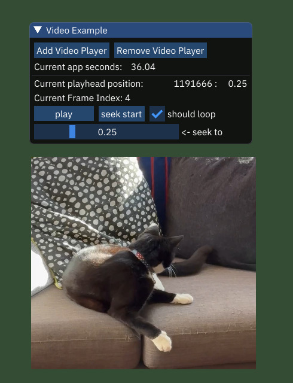

# Examples

Project Island comes with a growing number of examples. Each example
aims to highlight one key feature, and usually uses one or more
techniques to do so. Generally the aim is to be simple, except perhaps
with the *hello world* example. 

> [!TIP] 
>
> You can use any example as a starting point for a new Island
> project, by using the project generator script and setting this
> examples directory as the templates directory for the project
> generator: 
>
> ```bash
> # say, you keep your projects in `apps/my_projects`
> cd island/apps/my_projects/
>
> # this will create a new project based on `compute_example`
> ../../scripts/create_project.py -T ../examples/ -t screenshot_example my_new_project_name
> ```
>

| Screenshot | Info |
:---: | :---
 | [hello triangle](hello_triangle/) render a basic triangle.
 | [hello world](hello_world) render a more complex interactive scene with more advanced shaders, and camera interactivity.
 | [multi_window_example](multi_window_example/) Setup an app with more than one window.
 | [Compute Shader Example](compute_example/) simulate Gerstner Waves using a compute shader.
 | [Asterisks Game Example](asterisks/) a playable clone of the venerable arcade game following the ECS (entity-component-system) paradigm.
 | [Bitonic Merge Sort Example](bitonic_merge_sort_example/) Sort millions of pixels in parallel on the GPU.
 | [3D LUT color grading example](lut_grading_example/) load a 3D image and use it as a lookup table for a color-grading post-processing effect (mouse drag to sweep effect).
 | [imgui example](imgui_example/) use imgui to show a user interface, allow the user to change window background using the user interface.
 | [video player example](video_player_example/) play hardware accelerated videos, using the `le_video_decoder` module and Vulkan Video
 | [EXR Image Decode Example](exr_decode_example/) load OpenEXR images via the `le_resource_manager`, using `le_exr`
 | [Screenshot Example](screenshot_example/) save current screen contents as image file, using `le_screenshot`
