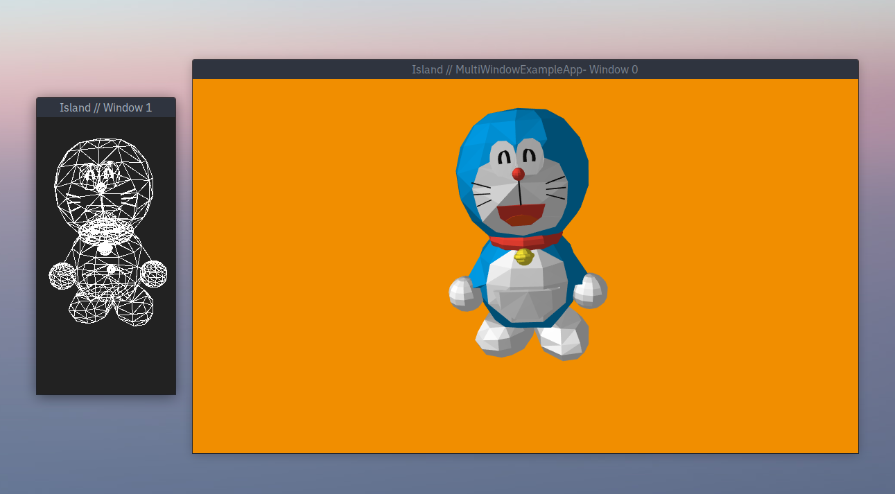
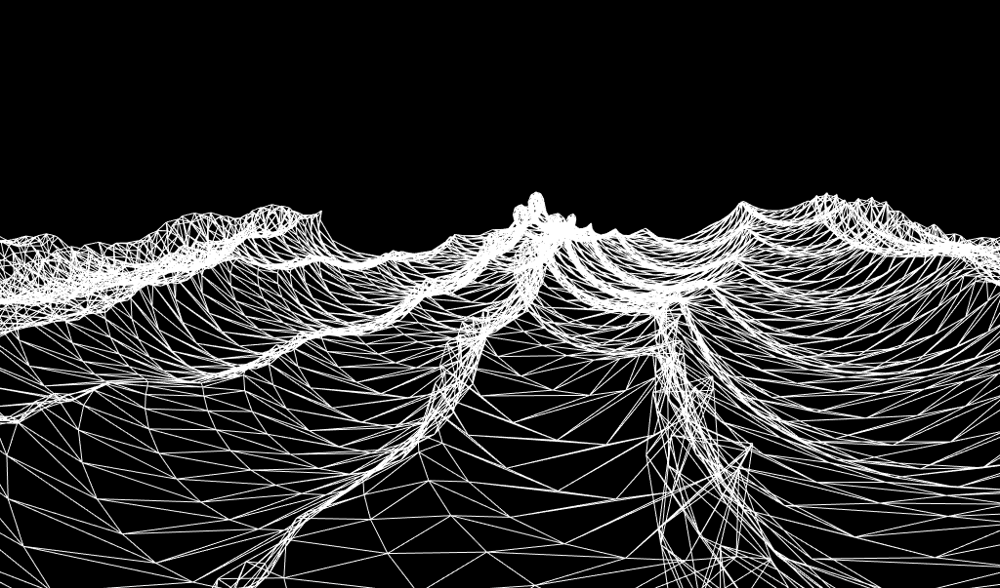
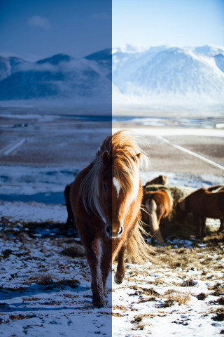
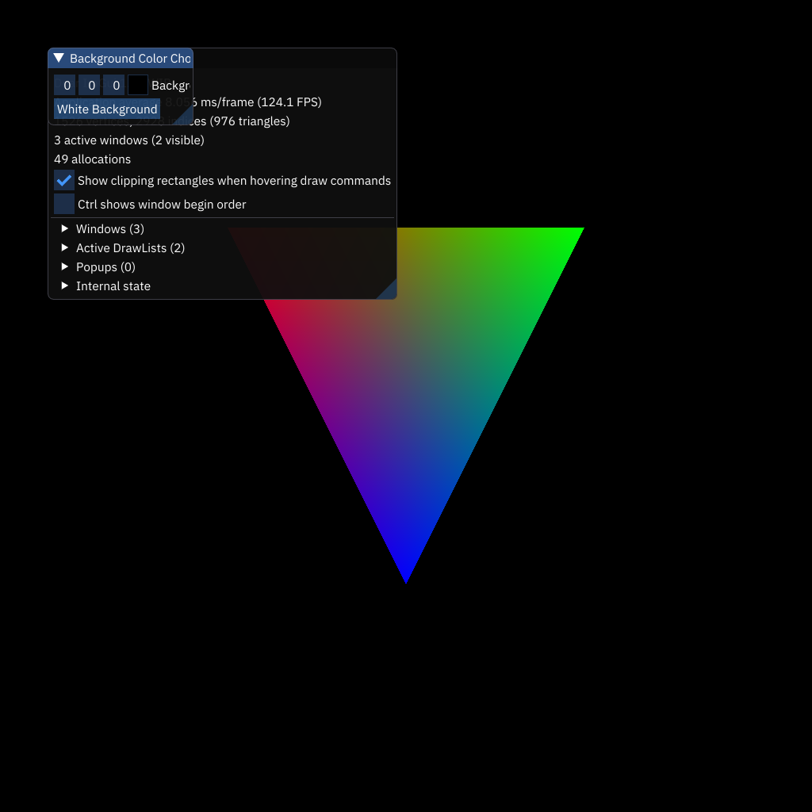

# Examples

Project Island comes with a growing number of examples. Each example
aims to highlight one key feature, and usually uses one or more
techniques to do so. Generally the aim is to be simple, except perhaps with the *hello world* example. 

| Screenshot | Info |
:---: | :---
 | [hello triangle](hello_triangle/) render a basic triangle.
 | [hello world](hello_world) render a more complex interactive scene with more advanced shaders, and camera interactivity.
 | [multi_window_example](multi_window_example/) Setup an app with more than one window.
 | [Compute Shader Example](compute_example/) simulate Gerstner Waves using a compute shader.
 | [3D LUT color grading example](lut_grading_example/) load a 3D image and use it as a lookup table for a color-grading post-processing effect (mouse drag to sweep effect).
 | [imgui example](imgui_example/) use imgui to show a user interface, allow the user to change window background using the user interface.

