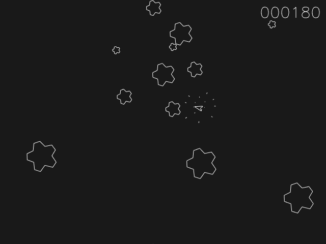
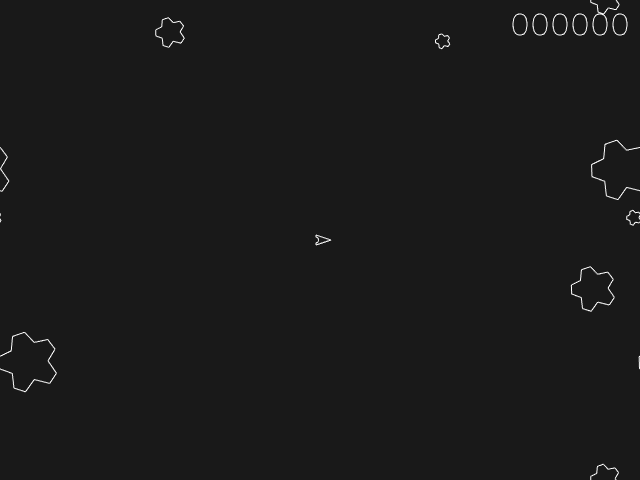

# Asterisks example

A clone of the venerable arcade game. Control a spaceship hunting for Asterisks - try catching them all, but avoid collisions!

## Game controls:

* SPACEBAR: shoot
* CURSOR LEFT/RIGHT: steer
* CURSOR UP: accelerate 

## Gamepad game controls:

* Button 'A': shoot
* Left Axis X: left/right
* Right Trigger: accelerate

## Techniques used / highlights:

Note that the implementation follows the [ECS](https://en.m.wikipedia.org/wiki/Entity_component_system) (entity-component-system) paradigm instead of an object-oriented approach.

* le_ecs - Island's rudimentary Entitiy-Component-System module
* instanced drawing to simulate torus-shaped universe (see [resources/shaders/line_art.vert](resources/shaders/line_art.vert))
* batched line drawing
* simple state machine for game state
* simple animation (explosions)
* Hershey vector font drawing (score, game over message)
* Gamepad input enabled

## Build instructions

Configure build environment using CMake: 

    mkdir build 
    cd build
    cmake -G Ninja ..

Note that if you are using Qt Creator you may skip manually setting up the build environment, and simply open the project CMakeLists.txt using Qt Creator.

Build using Ninja:

    ninja

Run application: 

    ./Island-Asterisks

