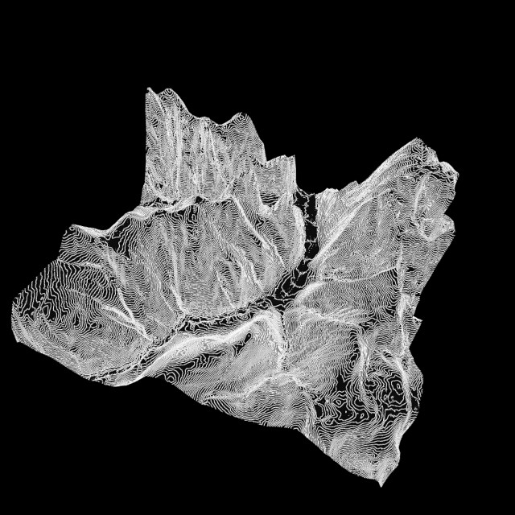

# Exr Decode Example

Renders a stylised 3D terrain, drawn with height lines.  

The terrain height map is loaded as a 32bit float .exr image, and
stored into a `R32Sfloat` GPU image resource. If the image is modified
and saved while the app is running, it will hot-reload the modified
image.

Note how the lines are nicely anti-aliased, and never thicker than one
pixel, regardless of how far or close to the camera they are - this is
possible by using a technique described by Evan Wallace in:
<https://www.madebyevan.com/shaders/grid/>

Note that this example app loads a 32bit float grayscale .exr image --
but the OpenEXR image decoder in `le_exr` can load many more .exr
image types: RGB, RGBA, 16bit and 32bit...

Note the build instructions below, as this example depends on some
image assets not contained in the main repository. 

## Camera controls:

* key O: toggle camera orthograhic / perspective projection
* key Z: reset camera
* key X: toggle camera orbit axis - when rotating, the camera either orbits around a point or rotates in-place
* mouse left button drag: rotate camera (when the camera is grabbed outside the center, tilt camera)
* shift+left button drag: - or - mouse right button drag: dolly camera (move forwards/backwards)
* ctrl + left button drag: - or - mouse middle button drag: pan camera up/down,left/right

## Techniques used: 

* `le_exr` - decode OpenEXR images
* using `le_resource_manager` to simplify image loading
* add OpenEXR decode capability to `le_resource_manager` via
  a one-liner (see line 75 in `exr_decode_example_app.cpp`).
* image hot-reloading
* depth testing
* rendering isolines
* constant-width aliased lines (see
  `./resources/shaders/isolines.frag`)

## Build instructions

Download image assets via the bash script in the project root folder.
(To keep the Island code repository slim, these image assets are
hosted outside of the main repo.)

    ./download_assets.sh

Configure build environment using CMake: 

    mkdir build 
    cd build
    cmake -G Ninja ..

Note that if you are using Qt Creator you may skip manually setting up
the build environment, and simply open the project CMakeLists.txt
using Qt Creator.

Build using Ninja:

    ninja

Run application: 

    cd bin
    ./Island-ExrDecodeExample

