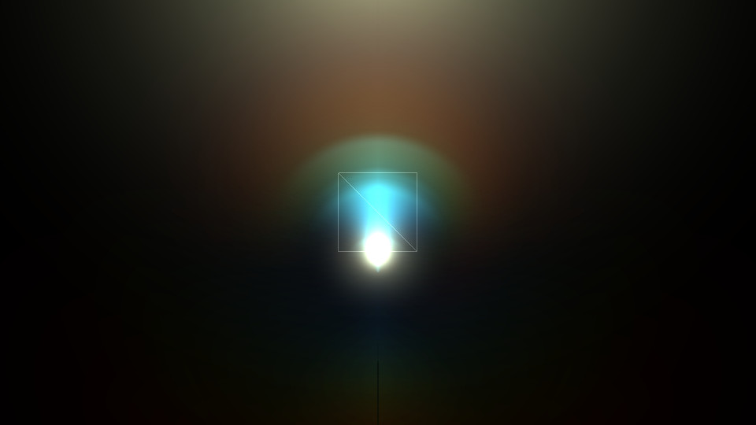

# Geometry shaders example

This example shows how to use geometry shaders to create billboards
for an artificial lensflare effect.

The lens flare effects in this example are procedurally created in the
fragment shader, which keeps them crisp, even at great scale.

