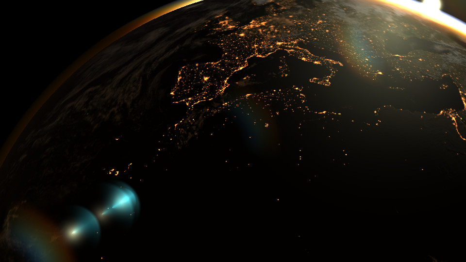

# Hello World example

Renders an interactive globe, and lens flares. 

Note how the cloud layer parallax effect works: the cloud texure uv coordinates are calculated in the fragment shader via ray-sphere intersection so that the coulds appear floating above the globe.

## Camera controls:

* key Z: reset camera
* key X: toggle camera orbit axis - when rotating, the camera either orbits around a point or rotates in-place
* mouse left button drag: rotate camera (when the camera is grabbed outside the center, tilt camera)
* shift+left button drag: - or - mouse right button drag: dolly camera (move forwards/backwards)
* ctrl + left button drag: - or - mouse middle button drag: pan camera up/down,left/right

## Techniques used: 

* mipmapping
* bump mapping
* image loading
* geometry shaders
* implements [Sean O'Neill's method](https://developer.nvidia.com/gpugems/gpugems2/part-ii-shading-lighting-and-shadows/chapter-16-accurate-atmospheric-scattering) to calculate atmospheric scattering

## Build instructions

Download image assets via the bash script in the project root folder. (To keep the Island code repository slim, these image assets are hosted outside of the main repo.)

    ./download_assets.sh

Configure build environment using CMake: 

    mkdir build 
    cd build
    cmake -G Ninja ..

Note that if you are using Qt Creator you may skip manually setting up the build environment, and simply open the project CMakeLists.txt using Qt Creator.

Build using Ninja:

    ninja

Run application: 

    ./Island-HelloWorld

